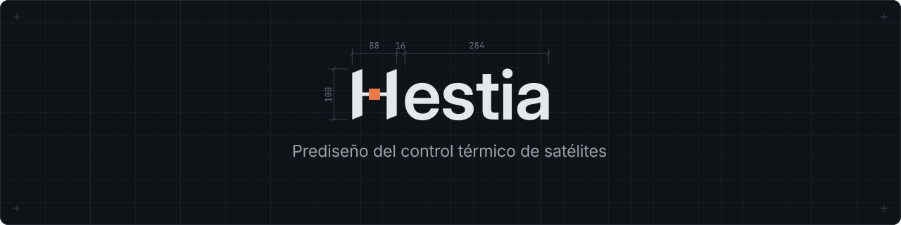

<p align="center">
  
</p>

Hestia cubre las fases 0 (viabilidad) y 1 (dimensionamiento nodal) del control térmico (TCS): de la misión y el balance global al modelo nodal, los casos de carga y los márgenes. El diseño detallado sigue en Siemens NX.

- **App de escritorio.** Cada proyecto es un archivo `.hestia` local.
- **Esquemático tipo Workbench.** Etapas conectadas; un cambio aguas arriba desactualiza lo que depende de él.
- **Trazable.** Todo cambio tiene autor, justificación, historial y deshacer.
- **Agentes como pares.** Todo lo que se hace en la UI también se puede hacer vía MCP. Los números salen siempre del núcleo de cálculo, nunca del agente.

## Estructura

| Módulo     | Qué es                                                     |
| ---------- | ---------------------------------------------------------- |
| `app/`     | UI en React + Vite, empaquetada con Tauri 2                |
| `backend/` | Lógica de dominio y física en Python (FastAPI)             |
| `mcp/`     | Servidor MCP; cliente HTTP de la API                       |
| `shared/`  | Contrato OpenAPI generado, fuente del cliente TS y del MCP |

## Desarrollo

Requiere [uv](https://docs.astral.sh/uv/), Node.js ≥ 20 con pnpm, [Rust](https://rustup.rs) con las [dependencias de Tauri](https://tauri.app/start/prerequisites/) y GNU Make.

```sh
make setup      # dependencias
make dev        # API en :8000 y UI en :5173 (navegador)
make desktop    # API y app de escritorio
make desktop-app  # solo la app de escritorio, sobre un `make dev` ya corriendo
make test
make lint
```

`make help` lista el resto.

## Documentación

[Arquitectura](docs/architecture.md) · [Workflow fases 0 y 1](docs/workflow-fases-0-1.md) · [Workspace](docs/ux-workspace.md) · [Convenciones](docs/conventions.md) · [ADRs](docs/adr/)

Instrucciones para agentes en `AGENTS.md` (raíz y cada módulo).
